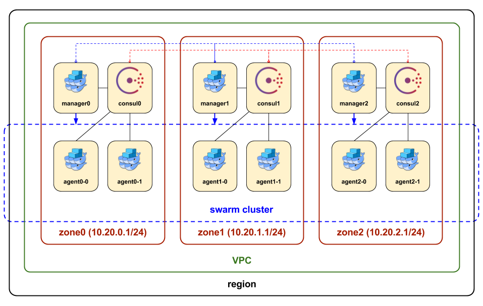

# About

HA & Scalable Swarm Cluster sample.

# Requirements

* [VirtualBox](https://www.virtualbox.org/wiki/Downloads)
* [docker](https://www.docker.com/)
  * docker-engine
  * docker-machine
  * docker-compose

# Getting started

create cluster machines.

```bash
bash ./create.sh
```

The cluster shown below is created.



# Try Ops

Try `docker` command on swarm mode machine.

```bash
eval $(docker-machine config manager-0)
docker info
docker service ls
docker stack ls
```

manager-0, manager-1, and manager-2 is "replicated manager nodes".

you can also use manager-1 instead of manager-0. The same is true for manager-2.

## Examples

### get swarm cluster info

```bash
docker $(docker-machine config manager-0) info
```

### deploy apps

```bash
cd myapp
docker-compose $(docker-machine config manager-0) up -d
```

### scale out docker-compose services

```bash
docker-compose $(docker-machine config manager-0) scale web=6
```

# Destroying

remove all machines

```bash
bash ./destroy.sh
```

### NOTE

You need to delete manually host-only networks which IP is `10.20.*.1/24` using VirutalBox GUI.

# License

MIT License
